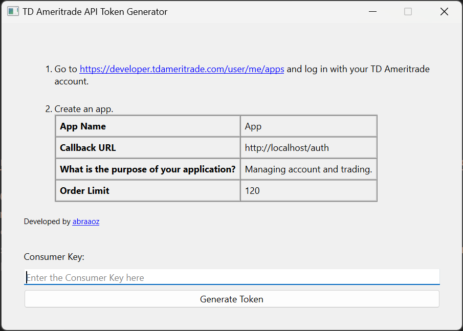

# TD Ameritrade API Token Generator

> Disclaimer: tda-generate-token is an unofficial API utility. It is in no way endorsed by or affiliated with TD Ameritrade or any associated organization. Make sure to read and understand the terms of service of the underlying API before using this package. This authors accept no responsibility for any damage that might stem from use of this package. See the [LICENSE](./LICENSE) file for more details.

### The goal of this project is to facilitate the generation of a JSON file (`tda-api-token.json`) to be used by the Python library [tda-api](https://tda-api.readthedocs.io/).

## Download

Windows, Linux, Mac releases are available at [Releases Page](https://github.com/abraaoz/tda-generate-token/releases/latest)



---

## Development mode

1. Make sure the `POETRY_VIRTUALENVS_IN_PROJECT` environment variable is set:
    ```bash
    export POETRY_VIRTUALENVS_IN_PROJECT=true
    ```

2. `poetry install`

3. `poetry run python -m app`

    If the application window does not appear in development mode on Linux, run the command below and try again:

      ```bash
      sudo apt install -y libxcb* libxkb*
      ```
